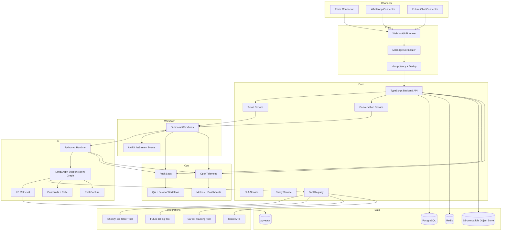
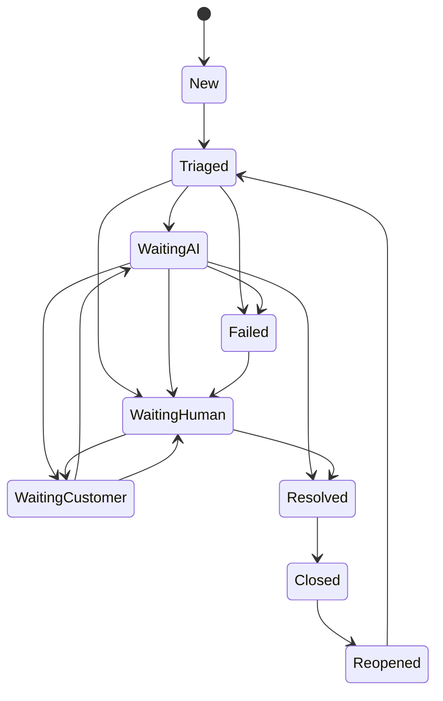
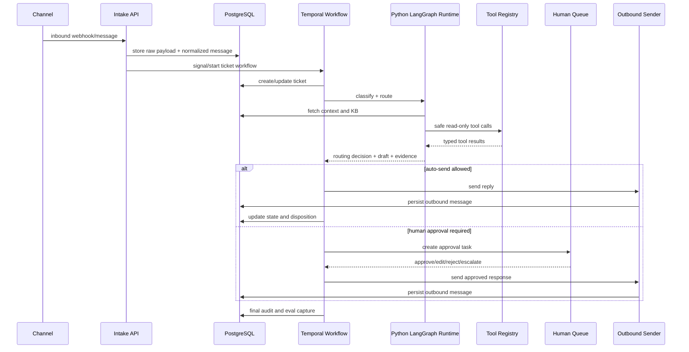
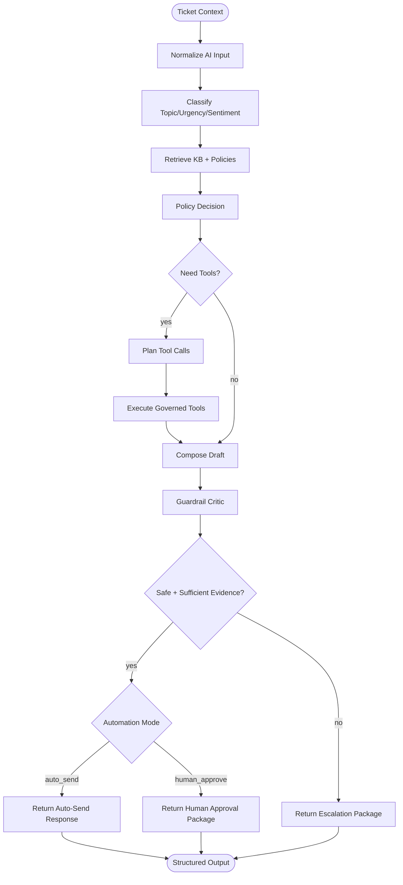

# AI-First Customer Support BPO Backend Plan

## 1. Purpose

Build a backend-first platform for an AI-first customer support BPO. The service receives customer conversations from support channels, turns them into tickets, enriches them with customer/order context, routes them through deterministic workflows, uses AI to draft or resolve eligible cases, keeps humans in approval loops where needed, and continuously improves through evaluation, QA, and operational feedback.

The first wedge is D2C/e-commerce brands with meaningful support volume and repetitive operational tickets.

V1 focuses on:

- Email and WhatsApp intake.
- English-only support.
- D2C/e-commerce workflows.
- Order status, refund eligibility, cancellation, and FAQ handling.
- AI draft plus human approval as the default mode.
- Narrow auto-send only after eval and QA gates are met.
- Backend contracts, durable workflows, AI harness, integrations, observability, and test foundation.

Frontend work is intentionally deferred until backend contracts stabilize. Backend APIs should be designed so the reviewer console can be built without reworking core contracts. The console lives in this repository at `apps/console` and is built at Milestone 23 (ADR-0026).

## 2. Product Thesis

Traditional BPO support operations scale by hiring and training human agents. This platform should scale by encoding support work into:

- Durable workflows.
- Typed integrations and tools.
- Tenant-specific policies.
- Retrieval-backed knowledge.
- Structured AI decision points.
- Human approvals for risky or ambiguous work.
- Continuous QA and eval loops.

The customer should experience the service as a plug-and-play support team with measurable SLA, quality, and cost improvements. Internally, the team operates an AI workforce with humans supervising, approving, and improving policies.

## 3. Non-Goals For V1

- No full frontend/agent console implementation during the build milestones. The reviewer console is Milestone 23 (`apps/console`, ADR-0026); a vertical slice proving the contract lands with Milestone 20.
- No voice support.
- No multilingual support beyond storing language metadata.
- No unrestricted auto-refunds.
- No autonomous writes to client systems without policy and approval gates.
- No marketplace-style integration ecosystem.
- No enterprise SSO or multi-region HA unless required by a pilot contract.
- No fine-tuning as a default solution; use prompt, RAG, tools, and evals first.

## 4. State-Of-The-Art Principles

### 4.1 Deterministic Outer Loop, AI Inner Decisions

Durable business workflows must be deterministic and replay-safe. AI should operate inside bounded activities or service calls. The outer platform controls retries, idempotency, state transitions, approvals, timeouts, and audit logs. The AI runtime makes structured decisions and drafts outputs, but it should not be the source of truth for business state.

### 4.2 Repository Knowledge Is The System Of Record

Future AI coding agents should not depend on chat history. Architecture, decisions, current tasks, test strategy, SOPs, and handoffs live in versioned markdown. `AGENTS.md` is the map; deeper docs hold the knowledge.

### 4.3 Governed Tools Over Free-Form Agents

Every integration available to AI must be exposed as a typed tool with:

- JSON-schema or Pydantic/Zod input validation.
- Typed output.
- Tenant scoping.
- Permission class.
- Side-effect class.
- Idempotency key.
- Timeout and retry policy.
- Audit logging.
- Human approval requirements where applicable.

### 4.4 Evidence-Bound Customer Replies

Every customer-facing AI draft must be grounded in one or more evidence sources:

- Tenant policy.
- KB article or FAQ.
- Order/customer/account data.
- Prior conversation messages.
- Approved macro or SOP.

If evidence is missing, the AI should ask a clarifying question or route to a human.

### 4.5 Human Approval Is A Product Feature

Human review is not a fallback after failure. It is a designed control point for:

- VIP customers.
- Refunds above limit.
- Legal threats.
- Chargebacks.
- Fraud suspicion.
- Angry sentiment.
- Low-confidence responses.
- Missing policy evidence.
- Integration write actions.

### 4.6 Eval-Driven Automation Expansion

Automation scope should expand only when offline evals, shadow-mode results, QA sampling, and pilot metrics show that a case type is safe. Auto-send should start narrow and grow by policy.

## 5. Reference Architecture

## 6. Technology Choices

### 6.1 TypeScript Backend

Use TypeScript for APIs, core domain services, workers, events, and integration boundaries.

Recommended framework:

- Fastify for lean services, or NestJS if the team wants opinionated modules and dependency injection.
- Default recommendation: Fastify plus explicit modules, because backend services will be agent-generated and simpler framework behavior is easier for AI agents to inspect.

Required supporting libraries:

- Zod for API and event boundary validation.
- Prisma or Drizzle for database access.
- Pino for structured logging.
- OpenTelemetry SDK/instrumentation.
- Temporal TypeScript SDK.
- NATS client.
- Redis client.

### 6.2 Python AI Runtime

Use Python for LangGraph, model/provider clients, eval harnesses, retrieval logic, and LLM-specific workflows.

Required supporting libraries:

- LangGraph for stateful agent graph.
- Pydantic for structured state and schema validation.
- OpenAI SDK and provider abstraction for models.
- LangSmith or OpenTelemetry-compatible trace export for LLM traces.
- pgvector/Postgres client for retrieval.
- pytest for unit and eval tests.

### 6.3 Temporal

Temporal owns durable support workflows:

- Ticket lifecycle.
- SLA timers.
- Human approval waits.
- Retries and backoff.
- Follow-up scheduling.
- Connector processing retries.
- Safe resume after worker/process failure.

Temporal workflows must not call LLMs directly. They call activities that invoke AI/runtime services. Workflows must use deterministic state and stable versioning patterns.

### 6.4 LangGraph

LangGraph owns the stateful AI graph inside bounded activities:

- Short-term agent state.
- Retrieval planning.
- Tool-use sequencing.
- Draft generation.
- Critique/guardrail branches.
- Human-interrupt state emitted back to Temporal.

Temporal remains the business process owner. LangGraph does not replace ticket state or SLA state.

### 6.5 PostgreSQL + pgvector

PostgreSQL is the source of truth. Use `pgvector` for V1 tenant-scoped semantic retrieval to keep operational complexity low and allow joins with tenant, policy, and KB metadata.

Move to Qdrant only when retrieval scale, hybrid filtering, multi-vector search, or latency demands exceed pgvector.

### 6.6 NATS JetStream

Use NATS JetStream as the v1 event bus for:

- Domain events.
- Async processing triggers.
- Internal fanout.
- Replayable operational event streams.

Use event subjects that are explicit, versioned, and tenant-aware. Upgrade to Kafka only if event analytics, massive replay, or many external consumers require it.

### 6.7 Redis

Use Redis for:

- Connector rate limits.
- Short-lived dedup locks.
- Cache of tenant config/policies.
- API throttling.
- Worker coordination where a durable workflow is unnecessary.

Do not use Redis as source of truth for ticket state.

### 6.8 Object Storage

Use S3-compatible object storage for:

- Raw webhook payloads.
- Attachments.
- Large transcripts.
- Export bundles.
- Redacted trace artifacts.

Store only references in PostgreSQL.

### 6.9 Observability

Use OpenTelemetry as the common instrumentation layer:

- Trace every request, workflow, activity, event, model call, retrieval query, and tool call.
- Emit structured logs with trace IDs.
- Record metrics for volumes, latencies, token/cost, automation rates, approval rates, escalations, and errors.

## 7. Core Backend Domains

### 7.1 Tenancy

Everything is tenant-scoped:

- Users and roles.
- Channels.
- Customers.
- Conversations.
- Tickets.
- Messages.
- Policies.
- KB documents.
- Integrations.
- Tools.
- AI runs.
- Audit events.

Tenant isolation must be enforced in repository/query layers, service guards, tool execution, retrieval filters, and audit logs.

### 7.2 Channels

V1:

- Email ingestion through IMAP/API polling or provider webhooks.
- Email outbound through SMTP/API.
- WhatsApp Business provider webhooks and outbound API.

V2:

- Chat widget.
- Instagram/FB DMs.
- In-app messages.

Channel adapters normalize inbound messages into one canonical message shape. Channel-specific details remain in raw payload/object storage and channel metadata.

### 7.3 Conversations

A conversation is a channel-specific or cross-channel thread with one customer. It contains ordered messages and may link to one or more tickets.

Threading rules:

- Email: provider thread ID, message headers, normalized subject fallback.
- WhatsApp: phone number plus provider conversation/window identifiers.
- Future chat: session ID plus customer identity.

### 7.4 Tickets

Tickets represent support work items. A ticket may contain many messages and workflow attempts.

Primary states:

Every state transition must create an audit event.

### 7.5 SLA

SLA policies define:

- First response due time.
- Next response due time.
- Resolution target.
- Priority-specific timers.
- Business hours.
- Pause conditions.
- Escalation rules.

Temporal owns timers. SLA breaches emit events and trigger escalation.

### 7.6 Policies

Policies are tenant-versioned configuration for:

- Refund rules.
- Cancellation rules.
- VIP handling.
- Auto-send eligibility.
- Human approval requirements.
- Tone and brand voice.
- Escalation paths.
- Data access permissions.
- Tool permissions.
- Channel templates.

Policy versions must be immutable once activated. A ticket should record the policy version used.

### 7.7 Knowledge Base

KB content includes:

- FAQs.
- Macros.
- Policies.
- Product documentation.
- Shipping/refund rules.
- Troubleshooting guides.
- Client-specific SOPs.

KB documents are versioned, chunked, embedded, indexed, and tenant-scoped. Responses must cite retrieved KB chunks or explain why no relevant KB exists.

### 7.8 Tools And Integrations

V1 tools:

- Order lookup.
- Shipment tracking lookup.
- Refund eligibility calculator.
- Cancellation eligibility calculator.
- Customer profile lookup.
- KB search.

V1 side effects:

- No actual refund execution.
- No destructive client-system writes.
- Draft only for refund/cancellation actions until policy and approval are mature.

V2 tools:

- Shopify connector.
- Stripe/Razorpay billing connector.
- Refund execution with limits.
- Returns management connector.
- CRM connector.

### 7.9 AI Runs

Every AI decision point creates an AI run record:

- Input references.
- Prompt version.
- Model/provider.
- Retrieved evidence.
- Tool calls.
- Structured output.
- Critic/guardrail results.
- Confidence/risk.
- Latency/tokens/cost.
- Human review outcome.
- Final disposition.

## 8. Ticket Workflow

## 9. LangGraph Agent Graph

## 10. Service Boundaries

### 10.1 API Service

Responsibilities:

- Auth and tenancy.
- REST/gRPC endpoints.
- Webhook ingress.
- Admin configuration APIs.
- Ticket/conversation/customer APIs.
- Approval APIs for future console.
- Read APIs for audit and metrics.

Must not:

- Execute long-running business workflows inline.
- Call LLMs directly.
- Perform integration side effects without tool governance.

### 10.2 Workflow Workers

Responsibilities:

- Temporal workflow definitions.
- Activities for DB updates, AI calls, outbound sends, and tool execution.
- SLA timers.
- Approval waits.
- Retry and compensation orchestration.

Must not:

- Contain nondeterministic code inside workflow definitions.
- Encode tenant policies directly in code.

### 10.3 AI Runtime

Responsibilities:

- LangGraph graph definitions.
- Prompt templates and versions.
- Structured AI outputs.
- Retrieval planning.
- Tool-use planning.
- Guardrails and critic.
- Eval capture.

Must not:

- Own durable ticket state.
- Bypass tool registry.
- Make unaudited integration calls.

### 10.4 Integration Service/Tool Registry

Responsibilities:

- Expose typed tools to AI and workflows.
- Validate inputs.
- Enforce tenant permissions.
- Execute side effects only when allowed.
- Record tool-call audit events.
- Hide provider-specific complexity.

Must not:

- Accept unvalidated free-form tool arguments.
- Return unbounded raw provider payloads to AI.

### 10.5 KB/RAG Service

Responsibilities:

- Ingest documents.
- Chunk and embed content.
- Version KB documents.
- Perform tenant-scoped retrieval.
- Return citations and evidence metadata.

Must not:

- Return cross-tenant data.
- Treat stale policy versions as active.

## 11. Public API Families

V1 backend APIs should be grouped by domain:

- `/v1/tenants`
- `/v1/channels`
- `/v1/customers`
- `/v1/conversations`
- `/v1/tickets`
- `/v1/messages`
- `/v1/policies`
- `/v1/kb`
- `/v1/integrations`
- `/v1/tools`
- `/v1/approvals`
- `/v1/ai-runs`
- `/v1/audit`
- `/v1/metrics`

All APIs require:

- Tenant context.
- Auth context.
- Request ID.
- Idempotency key for mutations where retries are expected.
- Structured errors.
- OpenAPI documentation.

## 12. Eventing

Use versioned domain events:

- `support.message.received.v1`
- `support.conversation.updated.v1`
- `support.ticket.created.v1`
- `support.ticket.triaged.v1`
- `support.ticket.priority_changed.v1`
- `support.ticket.assignment_changed.v1`
- `support.ticket.sla_breached.v1`
- `support.ai_run.started.v1`
- `support.ai_run.completed.v1`
- `support.tool_call.completed.v1`
- `support.approval.requested.v1`
- `support.approval.completed.v1`
- `support.message.sent.v1`
- `support.ticket.resolved.v1`
- `support.ticket.closed.v1`
- `support.qa.review_created.v1`

Event rules:

- Events are append-only facts.
- Event payloads are schema-validated.
- Events include `tenant_id`, `correlation_id`, `causation_id`, `occurred_at`, and `schema_version`.
- Consumers must be idempotent.

## 13. Security And Compliance

V1 must include:

- Tenant isolation.
- Role-based access control.
- Webhook signature verification.
- Secrets stored outside repo.
- PII redaction for logs and traces.
- Attachment size/type validation.
- Audit logs for AI, humans, and tools.
- Permission-scoped integration credentials.
- Data retention policy placeholders.
- Prompt-injection defenses for KB/tool outputs.

Security-sensitive actions must be human-approved until explicitly authorized by policy and tests.

## 14. Observability

Minimum signals:

- API request rate, latency, errors.
- Workflow success/failure/retry counts.
- Connector ingest lag.
- SLA timer breaches.
- AI latency, cost, tokens, provider errors.
- Retrieval hit rate and citation coverage.
- Tool call success/failure/latency.
- Human approval turnaround time.
- Auto-send rate.
- Escalation rate.
- QA defect rate.

Trace propagation must connect:

Inbound channel message -> API request -> workflow -> AI run -> retrieval -> tool calls -> outbound message -> audit/eval.

## 15. Evaluation And QA

V1 golden dataset:

- 100-300 representative tickets.
- Order status.
- Refund request within policy.
- Refund request outside policy.
- Cancellation before fulfillment.
- Cancellation after shipment.
- Shipping delay.
- Missing package.
- Basic FAQ.
- Angry customer.
- VIP customer.
- Legal threat.
- Chargeback mention.
- Ambiguous customer identity.
- Missing order number.
- Prompt injection in user text.
- Stale/contradictory KB.

Metrics:

- Correct classification.
- Correct route.
- Correct policy application.
- Evidence citation quality.
- No hallucinated policy.
- Safe tool use.
- Tone quality.
- Human edit distance.
- Resolution correctness.

Auto-send eligibility requires eval pass thresholds plus pilot QA approval.

## 16. Deployment Environments

Suggested environments:

- Local: Docker Compose for Postgres, Redis, NATS, Temporal, object storage, API, workers, AI runtime.
- Preview: per-branch deploy where feasible.
- Staging: production-like integrations with sandbox credentials.
- Production: managed Postgres, Redis, Temporal Cloud or self-hosted Temporal, NATS cluster, object storage, observability backend.

Every environment must have:

- Separate credentials.
- Separate tenant data.
- Migration process.
- Seed/test data policy.
- Observability enabled.

## 17. Milestones

### Milestone 0: Documentation Harness

Outcome:

- Agent-readable docs exist.
- Task checklist exists.
- Architecture defaults are recorded.

Acceptance:

- `AGENTS.md`, `PLAN.md`, `TODO.md`, and `docs/` are present and cross-linked.

### Milestone 1: Repo And Tooling Foundation

Outcome:

- Monorepo created with TS backend packages, Python AI package, shared schemas, local infra, lint/test/typecheck scripts.

Acceptance:

- Local infra boots.
- Empty health checks pass.
- CI runs lint/type/test.
- Docs updated with commands.

### Milestone 2: Data Model And API Skeleton

Outcome:

- Core database schema and domain APIs for tenants, customers, conversations, tickets, messages, policies, KB metadata, AI runs, tools, and audit.

Acceptance:

- Migrations apply cleanly.
- Contract tests cover API schemas.
- Tenant isolation tests exist.

### Milestone 3: Event Bus And Temporal Foundation

Outcome:

- NATS JetStream subjects and Temporal workers handle basic ticket workflow.

Acceptance:

- Message received starts or signals a workflow.
- Workflow creates/updates ticket state.
- Workflow tests verify deterministic state transitions.

### Milestone 4: Channel Intake

Outcome:

- Email and WhatsApp inbound adapters normalize messages.

Acceptance:

- Inbound fixtures create conversations and tickets.
- Dedup/idempotency tests pass.
- Raw payload references are stored.

### Milestone 5: KB/RAG

Outcome:

- Tenant KB ingestion, chunking, embeddings, pgvector retrieval, and citation output.

Acceptance:

- Retrieval tests prove tenant isolation.
- Eval fixtures can retrieve expected policy evidence.

### Milestone 6: Tool Registry

Outcome:

- Governed tools for mock order lookup, tracking lookup, refund eligibility, cancellation eligibility, and KB search.

Acceptance:

- Tool schemas are validated.
- Permission and side-effect tests pass.
- Tool audit logs are recorded.

### Milestone 7: AI Runtime

Outcome:

- LangGraph agent graph classifies, retrieves, calls tools, drafts replies, critiques, and returns structured outputs.

Acceptance:

- Eval tests pass on initial golden dataset.
- AI runs are traceable.
- Low confidence and risky cases escalate.

### Milestone 8: Approval And Outbound

Outcome:

- Human approval backend APIs and outbound send activities.

Acceptance:

- Workflow pauses for approval.
- Approved draft sends.
- Edited draft records human changes.
- Rejections/escalations are audited.

### Milestone 9: QA, Metrics, Pilot Hardening

Outcome:

- QA sampling, eval capture, dashboards, alerts, SOPs, and pilot readiness.

Acceptance:

- Pilot report metrics can be generated.
- Security checklist passes.
- Auto-send remains disabled except allowlisted low-risk cases.

### V1 Launch Phases (TODO.md Milestones 13-23)

The build milestones above were executed as Milestones 0-12 in `TODO.md` (its checklists are authoritative). All twelve are complete. Launch engineering continues as `TODO.md` Milestones 13-23 in four phases, with platform decisions recorded in `docs/DECISIONS.md` ADR-0020 (HTTP sidecar AI bridge; provider-agnostic model/embedding layer with Anthropic Claude + OpenAI `text-embedding-3-small` pilot defaults; hosted-IdP JWKS auth; single-VM hardened-Compose deployment) and ADR-0026 (the reviewer console lives in this repository at `apps/console`, `packages/api` is its backend, and the console UI is Milestone 23):

1. Phase 1 - Run End-To-End (Milestones 13-17): the production worker entrypoint with real ticket persistence; the Python AI runtime as an HTTP sidecar behind the Temporal `runAiGraph` activity with network retrieval/tools; the config-driven real model/embedding providers passing the eval gates; hosted-IdP authentication plus policy lifecycle endpoints; scheduled QA sampling and retention jobs with real purges.
2. Phase 2 - Deploy (Milestones 18-19): a production-shaped single-VM staging environment (TLS, Prometheus/Grafana/Alertmanager, offsite backups, CI deploys with tested rollback), then live Mailgun — and WhatsApp when Meta verification completes — with a full go-live rehearsal executing the SOPS §19 checklist.
3. Phase 3 - Console Enablement (Milestones 20 and 23): first the API surface the console consumes — CORS, approval queue ergonomics, an approval evidence composite, token-derived reviewer identity, rate limiting, the `packages/api-client` typed client, and a route↔spec drift test over the hand-written OpenAPI document — then the reviewer console itself at `apps/console` (Milestone 23), which should land before the Milestone 22 go-live so reviewers are not working the approval queue through raw HTTP.
4. Phase 4 - Pilot Readiness And Go-Live (Milestones 21-22): golden dataset expansion to the §15 counts with an LLM-graded quality rubric and shadow replay over historical tickets, then closing the known product gaps (attachment binary storage, HTML sanitization, next-response/resolution SLA timers, outbound subject strategy) and taking the pilot live in 100% human-approval mode with hypercare.

Milestone numbers are append-only identifiers, not an execution order: Milestone 23 belongs to Phase 3 and precedes Milestone 22. Renumbering was rejected because Milestones 21 and 22 are referenced by number inside accepted ADRs (ADR-0020, ADR-0021, ADR-0023) and `docs/PROJECT_HISTORY.md`.

Auto-send remains post-v1: the §17 rollout ladder in `docs/SOPS.md` starts only after pilot QA data supports it. Non-code launch work (provider/IdP accounts, VM and DNS, pilot client signing, KB collection, reviewer staffing) is tracked as the user-owned launch track in `TODO.md`; the console's only user-owned input is the shared Clerk application.

## 18. V2/V3 Roadmap

V2:

- Real Shopify connector.
- Stripe/Razorpay read-only billing.
- Chat widget.
- More robust routing rules engine.
- Auto-send expansion for order status and basic FAQ.
- Advanced QA workflows.

V3:

- Controlled refund execution.
- Multilingual support.
- Voice pipeline.
- Enterprise RBAC/SSO.
- Integration marketplace.
- Qdrant for large-scale retrieval.
- Kafka for analytics-heavy eventing.
- Multi-region/high-availability deployment.

## 19. Development Rules Summary

Detailed rules live in `docs/DEVELOPMENT_RULES.md`, but the core rules are:

- Tests first or tests with the change.
- Validate every boundary.
- Document every public contract.
- Keep workflows deterministic.
- Keep AI bounded and auditable.
- Update `TODO.md` before ending a session.
- Record architecture changes in `docs/DECISIONS.md`.

## 20. Source References

- OpenAI Harness Engineering: https://openai.com/index/harness-engineering/
- Codex AGENTS.md and repo guidance: https://developers.openai.com/codex/codex-manual.md
- Temporal docs: https://docs.temporal.io/
- LangGraph docs: https://docs.langchain.com/oss/python/langgraph/overview
- NATS JetStream docs: https://docs.nats.io/nats-concepts/jetstream
- pgvector: https://github.com/pgvector/pgvector
- OpenTelemetry: https://opentelemetry.io/docs/what-is-opentelemetry/
- Qdrant overview: https://qdrant.tech/documentation/overview/
